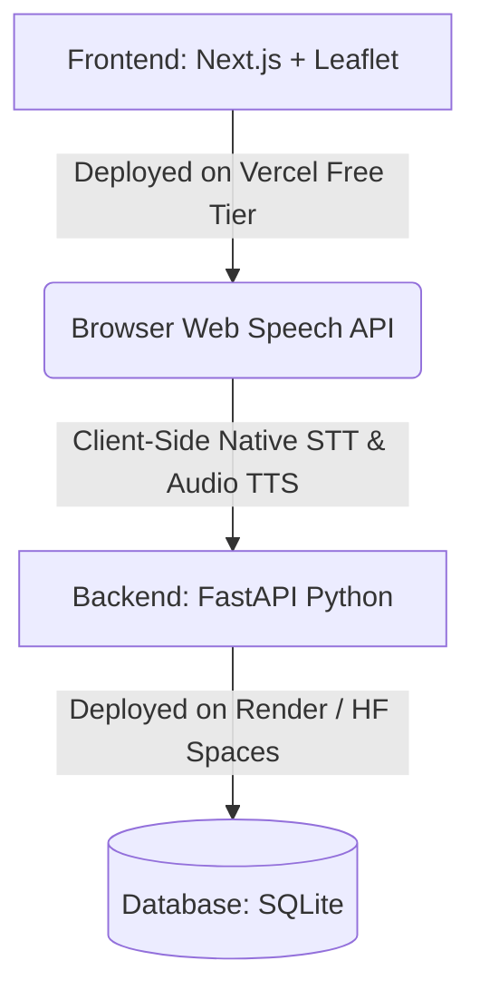
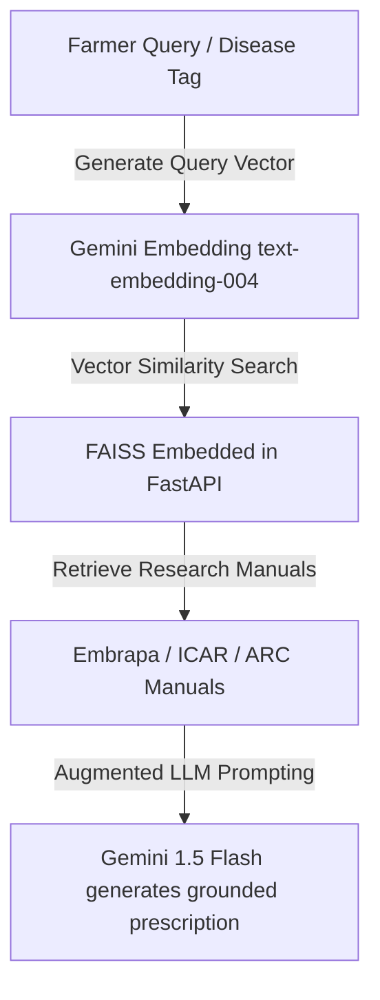

# FloraNet: BRICS Scalability Engine

FloraNet is a massive, multi-tiered Digital Public Good (DPG) designed to operationalize the BRICS Agricultural Research Platform (BARP) and the AgriN framework.

## Core Pillars of BRICS Scalability

┌─────────────────────────────────────────────────────────────────────────────┐
│                             FloraNet Core Engine                            │
├──────────────────────────┬──────────────────────────────────────────────────┤
│   Telemetry Ingestion    │ ──► Open-Meteo + ISRIC SoilGrids + NASA POWER    │
│   Multimodal Reasoning   │ ──► Gemini 1.5 Flash + Cloud Audio / Web Speech  │
│   Institutional Context  │ ──► FAO FAOSTAT + BARP / ICAR / Embrapa Manuals  │
│   Policy & DPG Output    │ ──► W3C JSON-LD Schema + Leaflet Outbreak Maps   │
└──────────────────────────┴──────────────────────────────────────────────────┘

### Institutional Research & Agronomic Models (BRICS Focus)
- **India (ICAR / KVKs)**: Bio-remedy recipes (Panchagavya, Trichoderma viride, Pseudomonas fluorescens foliar sprays) and drought-tolerant millet crop cycles.
- **Brazil (Embrapa Cerrado)**: Direct planting systems (Plantio Direto), biological nitrogen fixation via Bradyrhizobium, and regenerative green manure cover crops.
- **South Africa (ARC)**: Semi-arid soil conservation and transboundary Fall Armyworm (Spodoptera frugiperda) bio-trap management.
- **Data Standard**: AgriN Standardized Schema (JSON-LD) modeled on FAO AGROVOC thesaurus and BRICS Agricultural Research Platform (BARP).

### DPG Business & Sustainability Models
To ensure high marks on Deployability & Scalability as a Digital Public Good (DPG):

┌────────────────────────────────────────────────────────────────────────┐
│                        FloraNet DPG Ecosystem                          │
├──────────────────────────┬─────────────────────────────────────────────┤
│  Gov & Ministry Tier     │ ──► Open APIs for Extension Field Officers  │
│  Multilateral Funding    │ ──► BRICS New Development Bank (NDB) Grants │
│  Farmer Cooperative Tier │ ──► Free WhatsApp / PWA Edge Advisory       │
│  Input Supplier Trust    │ ──► Verified Bio-Fertilizer Registry (Free) │
└──────────────────────────┴─────────────────────────────────────────────┘

- **Government / Extension Integration (B2G)**: Deployed as a national digital infrastructure layer for agricultural ministries to monitor real-time pest outbreaks and crop stress.
- **Institutional Grant Funding**: Funded via multilateral climate and digital resilience initiatives (e.g., BRICS New Development Bank, FAO DPG funds, Global Digital Public Goods Alliance).
- **Bio-Input Cooperative Ecosystem**: Free listing and distribution network for local self-help groups and farmer producer organizations (FPOs) producing organic bio-fertilizers.

### Architecture Highlights
1. **Farmer Edge PWA (`/`)**: Offline-first diagnostics with dynamic PDF/WhatsApp sharing.
2. **Rotation Planner (`/planner`)**: 3-Year regenerative cash/cover crop simulation engine.
3. **Field Intelligence Hub (`/field-health`)**: Simulated Earth Engine layers (NDVI, NDRE) and dynamic geospatial mapping.
4. **Analytics Console (`/analytics`)**: Vertex AI Outbreak Projections and Macro KPI monitoring across BRICS borders.
5. **DPG Schema Hub (`/interop`)**: JSON-LD Federation Nodes and Swagger-powered API Playgrounds for institutional sync.
6. **Seed Network (`/seed-network`)**: Indigenous Seed matching utilizing agro-climatic overlap calculations to map resilient genetics from one BRICS nation to another.
7. **Transboundary Pest & Pathogen Early Warning Network (`/policy-dashboard`)**: every real leaf diagnosis contributes an *anonymized* geolocation (0.5° cell ≈ 55 km, no farmer identity, no exact farm coordinates) to a shared BRICS hotspot map, with derived Fall Armyworm migration vectors (bearing + great-circle distance) pointing at the nearest matching maize agro-ecological corridor in a neighbouring member state — every vector flagged `derived: true` with its exact arithmetic.

### Edge Usability & Accessibility Layers
- **Offline Field Diagnostics (PWA + Local Caching)**: Implement IndexedDB and service workers to allow farmers to queue leaf photographs and voice notes in zero-signal areas, syncing with Gemini once a connection is re-established.
- **WhatsApp / SMS Shareable "Agro-Card"**: A utility that compiles the Gemini diagnosis, local weather risk, and bio-remedy into a clean, text-only formatted WhatsApp template or printable single-page PDF for local Panchayat/KVK extension officers.
- **FAIR-Compliant AgriN Open Data Exporter**: A single button that exports any diagnostic record as an open JSON-LD / W3C DCAT Schema, demonstrating how research platforms like BARP or national ministries can instantly federate FloraNet data.

## The $0 Free & Open-Source Stack

To ensure FloraNet remains a true, accessible Digital Public Good, the architecture is designed to scale with zero overhead costs:

- **AI Engine**: Google AI Studio API key using Gemini 1.5 Flash / Gemini 2.0 Flash ($0 free tier with up to 15 RPM / 1,500 daily requests) for multimodal image diagnostics and structured JSON agronomic reasoning.
- **Weather & Soil Telemetry**: Open-Meteo API (completely free, open-source weather and soil moisture API requiring no API keys or credit card) for soil moisture depths and evapotranspiration.
- **Agro-Climatology & Radiation**: NASA POWER Agro-Climatology API for solar radiation, relative humidity, precipitation, and thermal degree days to model disease sporulation risks.
- **Global Soil Properties**: ISRIC SoilGrids REST API / OpenLandMap for free global endpoints for soil properties (Clay %, Sand %, pH, SOC, Nitrogen density).
- **Historical Agricultural Data**: FAO FAOSTAT & AGRIS Databases for programmatic access to 60+ years of historical crop yields, pesticide usage, and food security indicators.
- **Satellite & Multi-Spectral Imagery**: ESA Sentinel-2 via Copernicus Data Space Ecosystem (Sentinel STAC API) for 10m multi-spectral bands (NDVI, NDRE).
- **Historical Drought Mapping**: NASA Landsat 8/9 via USGS EarthExplorer / AWS Open Data for 30m thermal & surface reflectance.
- **Vegetation Indices**: Copernicus Land Monitoring (CLMS) for soil moisture deficit and vegetation condition index.
- **Voice & Speech**: Native Browser Web Speech API (`webkitSpeechRecognition` & `window.speechSynthesis`) for zero-cost multilingual transcription and audio playback on the edge.
- **Geospatial & Maps**: Leaflet.js + OpenStreetMap / CartoDB (100% open-source, no billing accounts required) for zero-cost basemaps and farm polygon geofencing.
- **Diagnostic Ground Truth**: PlantVillage Dataset & Open Agro-Databases (Hugging Face / Kaggle) to validate diagnostic accuracy.
- **Database & Hosting**: Embedded SQLite for zero-latency file storage.

### Deployment Architecture ($0 Hosting & Run)

### The $0 Free & Open-Source RAG + LLM Stack
- **LLM & Embeddings**: Gemini 1.5 Flash (via Google AI Studio Free Tier) for both generative responses and text embeddings (`text-embedding-004`).
- **Vector Store**: FAISS running locally in-memory or persisted via embedded SQLite files (100% open-source, no external hosted database costs).
- **Knowledge Base**: Curated markdown/text chunks containing regional regenerative guidelines, bio-fertilizer recipes (Jeevamrutha, Trichoderma application), and BRICS seed catalogues.

### How the $0 RAG Pipeline Works in FloraNet

In standard setups, asking an LLM for crop disease remedies risks generic or unsafe chemical advice. With RAG in FloraNet, the diagnostic pipeline queries verified agronomic handbooks from ICAR (India), Embrapa (Brazil), and ARC (South Africa) to prescribe region-specific, organic bio-treatments.

